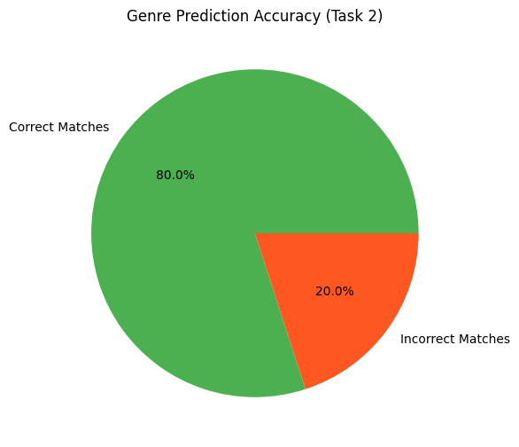

# LLM-Based Movie Description Generation, Genre Prediction & Plot Twist Creation

This project explores the application of Large Language Models (LLMs) for creative and analytical tasks on movie datasets, including description generation, genre prediction, and plot twist creation.

---

## 🚀 Overview

* Implemented 3 NLP tasks using LLMs:

  1. Creative description generation
  2. Genre prediction
  3. Plot twist generation
* Used Hugging Face Transformers in Google Colab
* Achieved **80% accuracy** in genre prediction
* Generated structured JSON outputs for all tasks

---

## 🧠 Tasks

### 🔹 Task 1: Description Generation

* Model: `microsoft/phi-2`
* Generated creative descriptions from title + original summary

---

### 🔹 Task 2: Genre Prediction

* Model: `facebook/bart-large-mnli` (zero-shot classification)
* Predicted genres without training

📊 Accuracy: **80% (16/20 correct)** 

---

### 🔹 Task 3: Plot Twist Generation

* Model: `microsoft/phi-2`
* Generated alternate endings and twists

---

## 📂 Dataset

* Custom dataset with 20 movies
* Fields:

  * title
  * description
  * genres
  * cast

Example entry:

```json
{
  "movie_title": "Do Patti",
  "genres": ["Drama", "Thriller"],
  "description": "A psychological mystery..."
}
```

---

## 📊 Results

### Genre Prediction Accuracy



* Correct predictions: 80%
* Incorrect predictions: 20%

---

## 📁 Project Structure

* `movie_dataset.json` → Original dataset
* `task1.json` → Generated descriptions
* `task2.json` → Genre predictions
* `task3.json` → Plot twists

---

## ⚙️ Tech Stack

* Python
* Hugging Face Transformers
* PyTorch
* Pandas, NumPy

---

## 📄 Report

📥 [View Report](./report.pdf)

---

## 🔗 Key Highlights

* Zero-shot learning for genre classification
* Creative text generation using LLMs
* Structured JSON outputs
* Efficient model selection under resource constraints

---

## 🔗 Future Work

* Fine-tune models for better accuracy
* Expand dataset
* Use larger LLMs (LLaMA, GPT)
* Build web interface for interaction

---
